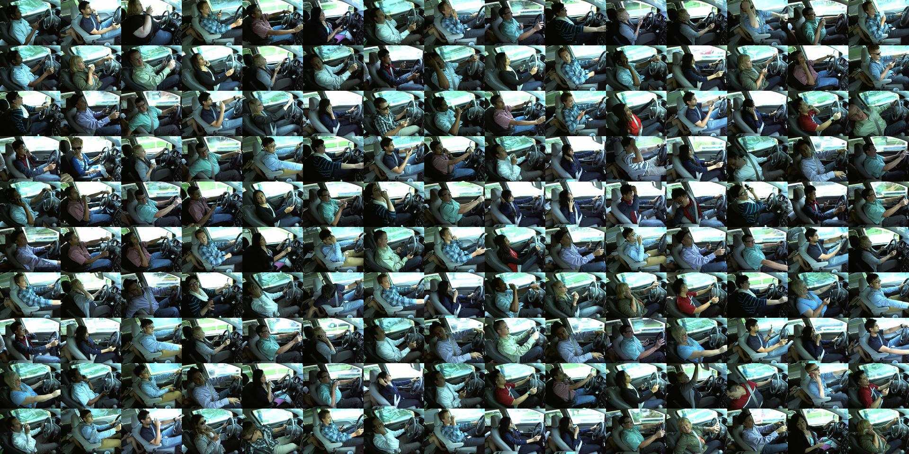
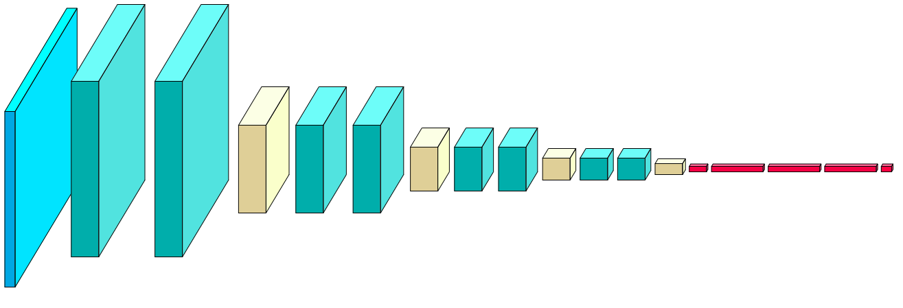
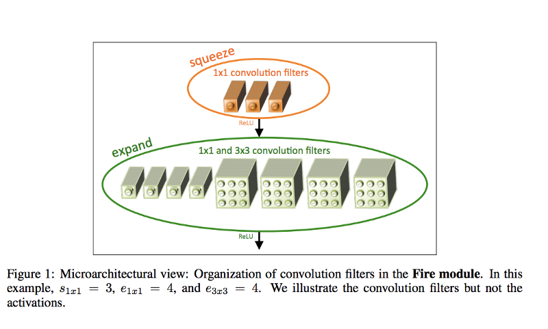

## Abstract:
Recently there is a focus on driver monitoring systems in the automotive industry. The increasing number of traffic accidents due to fatigue and distraction became a problem of serious concern to society.
According to the CDC motor vehicle safety division, [one in five car accidents](https://www.cdc.gov/motorvehiclesafety/distracted_driving/) is caused by a distracted driver. Sadly, this translates to 
425,000 people injured and 3,000 people killed by distracted driving every year.
There are many approaches trying to effectively detect driver's fatigue or distraction, but all of them suffer from either great complexity, leading to inability to be integrated in low computational power device, or
oversimplicity, which leads to low accuracy of the final results of the method. 
Convolutional neural netowrks (CNNs) have a huge advantage over this problem as they offer robust models with complex features which are learnt instead of explicitly programmed. 



## Introduction:
This article's aim is to propose real-time driver monitoring system with focus to distraction. The article presents state-of-the-art deep convolutional neural network achieving accuracy over 99.7% 
after being trained on 20K and validated on 2.5K over 10 classes. Starting with this 820K trainable parameters model we end up with 10 times smaller model with same accuracy, but with better speed and more compact.

## Data:
The dataset used for training is provided by _https://www.statefarm.com_ in order to help improve these alarming statistics mentioned above, and better insure their customers, by testing whether dashboard cameras can automatically 
detect drivers engaging in distracted behaviors.

The 10 classes to predict are:

 * safe driving
 * texting - right
 * talking on the phone - right
 * texting - left
 * talking on the phone - left
 * operating the radio
 * drinking
 * reachingg behind
 * hair and makeup
 * talking to passenger

#### _In future I'm going to present bigger dataset with a few more classes, which I find important (eg. smoking, eating, etc.)._

## Solution

Three main approaches were investigated : 
1. Straight-forward deep CNN trained on ground truth values.
2. Compressed CNN trained using _dark knowledge_.
3. aSqueezeNet architecture.

After comparing the results from all of the approaches the article comes with the best model.

### Straight-forward deep CNN trained on ground truth values
The first described approach is to build CNN and train it on the available dataset using Adam as optimizer and cathegorical crossentropy as loss function.


Fig1: aNet

Here's a summary of the model shown in Fig1:
```
_________________________________________________________________
Layer (type)                 Output Shape              Param #   
=================================================================
input_1 (InputLayer)         (None, 96, 128, 3)        0         
_________________________________________________________________
block1_conv1 (Conv2D)        (None, 96, 128, 64)       1792      
_________________________________________________________________
block1_conv2 (Conv2D)        (None, 96, 128, 64)       36928     
_________________________________________________________________
block1_pool (MaxPooling2D)   (None, 48, 64, 64)        0         
_________________________________________________________________
block2_conv1 (Conv2D)        (None, 48, 64, 64)        36928     
_________________________________________________________________
block2_conv2 (Conv2D)        (None, 48, 64, 64)        36928     
_________________________________________________________________
block2_pool (MaxPooling2D)   (None, 24, 32, 64)        0         
_________________________________________________________________
block3_conv1 (Conv2D)        (None, 24, 32, 128)       73856     
_________________________________________________________________
block3_conv2 (Conv2D)        (None, 24, 32, 128)       147584    
_________________________________________________________________
block3_pool (MaxPooling2D)   (None, 12, 16, 128)       0         
_________________________________________________________________
block4_conv1 (Conv2D)        (None, 12, 16, 128)       147584    
_________________________________________________________________
block4_conv2 (Conv2D)        (None, 12, 16, 128)       147584    
_________________________________________________________________
block4_pool (MaxPooling2D)   (None, 4, 5, 128)         0         
_________________________________________________________________
flatten_1 (Flatten)          (None, 2560)              0         
_________________________________________________________________
dense_1 (Dense)              (None, 64)                163904    
_________________________________________________________________
dense_2 (Dense)              (None, 128)               8320      
_________________________________________________________________
dense_3 (Dense)              (None, 128)               16512     
_________________________________________________________________
output (Dense)               (None, 10)                1290      
=================================================================
Total params: 819,210
Trainable params: 819,210
Non-trainable params: 0
```
---

After `30 epochs` with `batch size 32` the model achieves `0.9972 accuracy on the train set and 0.9938 accuracy on the validation set`.

### Compressed CNN trained using _dark knowledge_

Since the first approach is too computationally heavy we cannot achieve real-time prediction on embedded system, so we are going to use one really [simple, but interesting](http://fastml.com/geoff-hintons-dark-knowledge/) 
idea proposed by *Geoff Hinton*.

The basic idea of the solution is to train a simpler model that mimics the CNN. To make it work, one replaces the actual class labels with predictions from the model we wish to mimic.
This great idea can also be used to mimic complex ensemble models which results in even better compression as final result.

Really good brief explanation of the technique given from [Rich Caruana](http://www.cs.cornell.edu/~caruana/):

_We take a large, slow, but accurate model and compress it into a much smaller, faster, yet still accurate model. This allows us to separate the models used for learning from the models used to deliver the learned  so that we can train large, complex models such as ensembles, but later make them small enough to fit on a PDA, hearing aid, or satellite. With model compression we can make models 1000 times smaller and faster with little or no loss in accuracy._

So we end up with predicted values from our first model, which we use to train this compressed CNN.
Reducing the compressed CNN parameters to 85K results in `0.9856 on train samples and 0.9737 accuracy on validation samples`

Surprisingly if we use the same model, but instead we train it on ground truth values, we end up with almost the same results, which makes us go even further.

Training on ground truth values even smaller model with only 10K parameteres results in overfit and not so good model - `0.904 accuracy on training samples and 0.916 accuracy on validation samples`.
Here _dark knowledge_ comes in power and training a model with 10K which mimics our baseline model results in `0.948 accuracy on training data and 0.941 on validation data` - much better results!

### aSqueezeNet
Originally SqueezeNet provides an architecture achieving the same accuracy as AlexNet, but is 3x times faster and 500x smaller, compared to AlexNet.

The main ideas of SqueezeNet are:


 * Using 1x1 (point-wise) filters to replace 3x3 filters, as the former only 1/9 of computation.
 * Using 1x1 filters as a bottleneck layer to reduce depth so computation of the following 3x3 filters is reduced.
 * Downsample late to keep a big feature 


_[Image source](https://arxiv.org/pdf/1602.07360.pdf)_

So comes the idea to use SqueezeNet-like architecture to achieve high accuracy and low computational requirement. That's how aSqueezeNet comes.
It's architecture is the same as the original SqueezeNet, but it's a bit smaller, so it achieves even better speed and size for the problem it solves.

Starting with 120K trainable parameters model we achieve `0.982 accuracy on train samples and 0.971 on validation samples.`
Reducing it's parameters to 75K we end up with `0.9823 accuracy on train and 0.9755 on validation` and really fast and small model.

### Comparison of the models for given number of parameters

<style type="text/css">
table {
color: #333;
font-family: Helvetica, Arial, sans-serif;
width: 640px;
border-collapse:
collapse; 
border-spacing: 0;
}
td, th {
border: 1px solid transparent; /* No more visible border */
height: 30px;
}
th {
background: #DFDFDF; /* Darken header a bit */
font-weight: bold;
}
td {
background: #FAFAFA;
text-align: center;
}
table tr:nth-child(odd) td{
background-color: white;
}
</style>
<table border="1" class="dataframe">
  <thead>
    <tr>
      <th></th>
      <th colspan="2" halign="left">10000</th>
      <th colspan="2" halign="left">80000</th>
      <th colspan="2" halign="left">820000</th>
    </tr>
    <tr>
      <th></th>
      <th>test</th>
      <th>train</th>
      <th>test</th>
      <th>train</th>
      <th>test</th>
      <th>train</th>
    </tr>
  </thead>
  <tbody>
    <tr>
      <th>aNet</th>
      <td>0.916</td>
      <td>0.940</td>
      <td>0.991</td>
      <td>0.991</td>
      <td>0.993</td>
      <td>0.997</td>
    </tr>
    <tr>
      <th>aNet-DN</th>
      <td>0.941</td>
      <td>0.948</td>
      <td>0.973</td>
      <td>0.985</td>
      <td></td>
      <td></td>
    </tr>
    <tr>
      <th>aSqueezeNet</th>
      <td>0.918</td>
      <td>0.915</td>
      <td>0.975</td>
      <td>0.982</td>
      <td></td>
      <td></td>
    </tr>
  </tbody>
</table>

### _Please, note that though the numeric results as accuracy and coverage are equal for some models, there is difference in the models' processing time and size!_

---

## Pretrained models can be found at [the aNet github repo](https://github.com/Zarrie/aNet).


---

### References:

[1] arXiv:1503.02531v1 [stat.ML] 9 Mar 2015

[2] arXiv:1602.07360v4 [cs.CV] 4 Nov 2016

[3] arXiv:1412.6980v9 [cs.LG] 30 Jan 2017